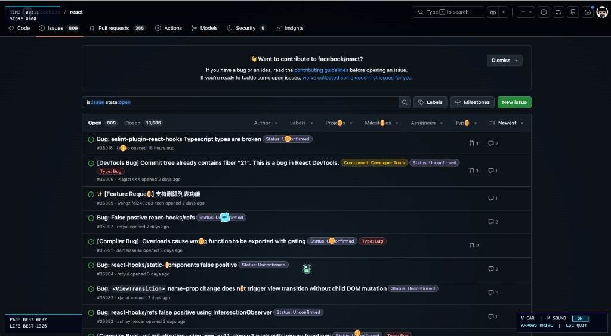

# DOM Racer

A Chrome / Edge extension that turns any webpage into a tiny arcade track.

Links become loot. Text becomes walls. Images become ice. Buttons become coins. Police show up when you get too comfortable. An airplane drops weird gifts from the sky. The page you were reading five seconds ago is now a hostile little arena, and you love it.

## Why This Is Fun

Most browser extensions add features. This one turns your tab into a game.

The magic is that every page plays differently. A docs page is a maze of text walls. A dashboard is an open racetrack with scattered buttons. A landing page is a slippery ice rink full of hero images. You never know what the track will look like until you press the hotkey.

Then: coins to chase, power-ups to grab, a combo system that rewards greed, police cars that punish staying too long, and a propeller plane that drops route moments across the map. The difficulty curve is simple: the longer you survive, the weirder it gets.

## Store-Friendly Pitch

DOM Racer turns every page into a tiny arcade track: dash through live UI, scoop coin lines, trigger weird specials, and survive cleanly telegraphed police pressure without leaving your tab.

## Quick Start

```bash
npm install
npm run build
```

1. Open Chrome or Edge extensions page
2. Enable Developer Mode
3. Click `Load unpacked` and select the `dist/` directory
4. Open any page and press `Shift + R` (or ``Shift + ` ``)

## Controls

| Context | Key | Action |
|---|---|---|
| Anywhere | `Shift + R` or ``Shift + ` `` | Toggle DOM Racer |
| In game | `WASD` / arrow keys | Drive |
| In game | `R` | Restart run |
| In game | `V` | Switch vehicle design |
| In game | `M` | Toggle sound |
| In game | `Shift + D` | Sprite showcase mode |
| In game | `Esc` | Quit |
| Game over | `Space` | Restart |
| Game over | `Esc` | Quit |

## Current Features

- Page text is scanned into readable wall geometry
- Images and pictures become slippery ice zones
- Reactive visual surfaces become speed-up zones
- Links and buttons spawn money pickups
- Ambient special pickups spawn independently from normal money
- `FLOW` streaks recolor regular coins to make the streak state obvious
- Power-ups: `MAGNET`, `INVERT`, `GHOST`, `BLACKOUT`
- Airplane flyovers with five drop modes: bonus drop, coin trail, spotlight, lucky wind, police delay
- Police chases with edge warnings and a proper `GAME OVER` screen
- Run auto-pauses with a clear overlay when the page/tab loses focus
- Sound toggle, vehicle design toggle, sprite showcase debug mode
- Page best and lifetime best scores persist through storage

## How The World Is Built

DOM Racer scans the currently visible page and translates it into a compact arcade arena.

- Large fixed UI near page edges becomes barriers
- Links and button-like elements become money pickups
- Text blocks are converted into wall slices using visible text bounds
- Images and pictures become ice
- Visually reactive surfaces become boosts
- Random special pickups spawn into free space during the run

The result is intentionally game-ish rather than perfectly literal. The goal is to preserve the feel of the page while still making it readable and fun as a racer.

## Power-Ups

- `MAGNET`: pulls coins and specials toward the player
- `INVERT`: flips page colors
- `GHOST`: temporarily relaxes movement pressure and blocks police lock
- `BLACKOUT`: darkens the page for a short high-pressure stretch (adapts to `INVERT` on dark surfaces)

The active power-up panel in the top-right HUD shows remaining duration.

## Airplane Events

A propeller plane occasionally crosses the arena and drops one of five route moments:

- **Bonus drop**: a special pickup appears at the drop point
- **Coin trail**: a short-lived line of regular coins spawns along the flight path
- **Spotlight**: an existing special pickup gets highlighted with a longer cue
- **Lucky wind**: nearby coins are gently nudged into a readable route
- **Police delay**: police spawn timing is briefly pushed back

Each mode has its own fallback: if conditions are not right at drop time, the plane safely resolves to a bonus drop instead.

## Screenshots & Motion



_More captures coming soon._

| Moment | Type | Status |
|---|---|---|
| Normal run | Screenshot | Done |
| Special pickup | Screenshot | Planned |
| Police chase | GIF | Planned |
| Police GAME OVER | Screenshot | Planned |
| Airplane flyover | GIF | Planned |
| Coin trail | GIF | Planned |
| Lucky wind | GIF | Planned |

## Persistence

DOM Racer stores sound setting, selected vehicle design, page best score, lifetime best score, and per-page run stats using `chrome.storage.local` (with `localStorage` fallback).

## Roadmap

| Phase | Status | Goal |
|---|---|---|
| Core money loop | Mostly done | Lock the collectible loop |
| Overgrowth difficulty | Planned | Trees and bushes that grow over time |
| Airplane event | Mostly done | Rare stylish world events |
| Indie juice | Planned | Near-miss bonuses, page moods, police escalation |
| Production hardening | In progress | Tests, structure, release readiness |
| Presentation | In progress | README polish, screenshots, store assets |

## Debug Mode

Use `Shift + D` to open the sprite/debug showcase mode for visual checks and quick style validation. No page-level debug API is exposed.

## Project Layout

```text
branding/        SVG sources and branding generator
public/          Manifest and static extension assets
src/content/     DOM scanning, overlay bootstrapping, page integration
src/game/        Game loop, rendering, audio, HUD, player logic
src/shared/      Shared types, utils, persistence helpers
src/styles/      Overlay and page-effect styles
```

## Development

```bash
npm run dev       # Rebuild on file changes
npm run build     # Type-check + production build
npm run typecheck # TypeScript only
npm run test      # Run smoke tests
npm run brand     # Regenerate extension icons and marketplace graphics
```

## Stack

Manifest V3, TypeScript, Vite, Canvas 2D, Web Audio API.

## Notes

- The extension only requests `storage` permission
- The game runs on top of the current page and blocks native interaction while active
- Host scope uses `<all_urls>` because the core interaction model requires running on arbitrary pages

## License

No license file is included yet.
